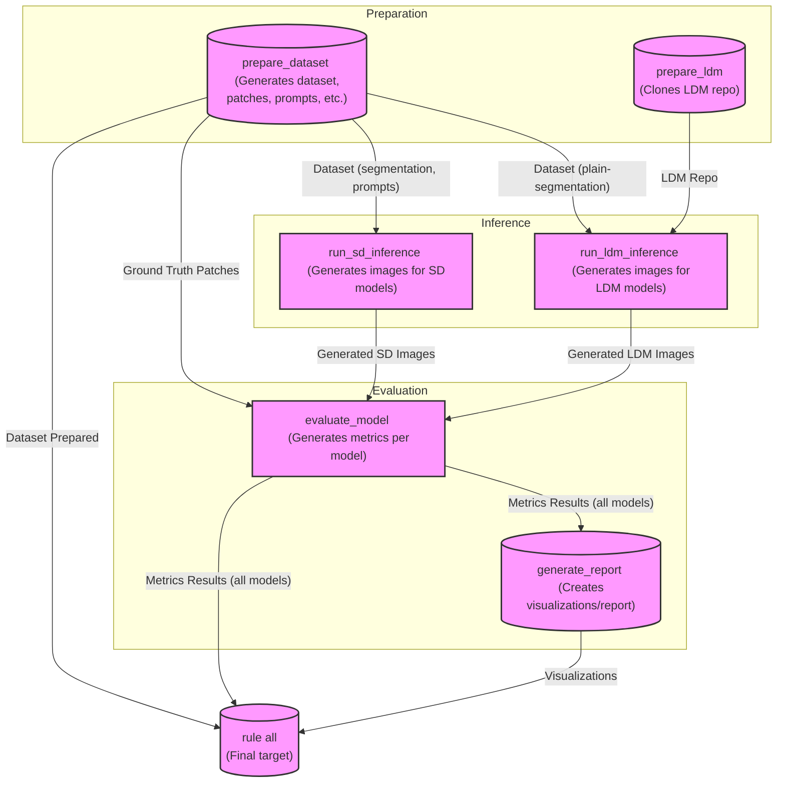

# Diffusion Models Evaluation Framework

This project provides a comprehensive framework for evaluating diffusion models, with a focus on Stable Diffusion 3 ControlNet for image generation tasks. It uses Snakemake for workflow management to streamline the process of dataset preparation, inference, and metric evaluation.

## Project Structure

```
diffusion_models_evaluation/
├── config/                      # Configuration files
│   ├── accelerate_config.yaml   # Configuration for multi-GPU inference
│   ├── evaluation.yaml          # Main evaluation configuration
│   ├── metrics.yaml             # Metrics configuration
│   └── downstream_tasks/        # Configs for downstream tasks
├── data/                        # Dataset storage
│   ├── drsk_10k_seed_42/        # DRSK dataset with 10k samples
│   └── test/                    # Test dataset
├── models/                      # Model storage directory
│   ├── ldm/                     
│   ├── sd21_controlnet/        
│   └── sd35_controlnet/        
├── results/                     # Results from inference & evaluation
│   ├── drsk_10k_seed_42/        
│   └── test/                    
├── scripts/                     # Python scripts
│   ├── downstream_tasks/        # Downstream task scripts
│   ├── evaluation/              # Evaluation scripts
│   ├── inference/               # Inference scripts
│   └── preparation/             # Dataset preparation scripts
├── utils/                       # Utility functions
├── workflow/                    # Workflow definitions
│   ├── airflow/                 # Airflow DAGs (alternative to snakemake)
│   └── snakemake/               # Snakemake workflow definitions
├── add_dataset.sh               # Script to add new dataset structure
├── create_structure.sh          # Script to create initial directory structure
└── requirements.txt             # Python dependencies
```

## Installation

1. Clone the repository:
   ```bash
   git clone https://github.com/yourusername/diffusion_models_evaluation.git
   cd diffusion_models_evaluation
   ```

2. Install dependencies:
   ```bash
   pip install -r requirements.txt
   ```

Troubeshoot: 
- If there is issue with Snakemake installation:
```bash
conda install -c bioconda snakemake
```

- Login to huggingface if there is issue with downloading model:
```bash
huggingface-cli login
```

- If port 29500 is being occupied:
```bash
sudo systemctl restart NetworkManager
```

3. Set up your directory structure (if not already created):
   ```bash
   bash create_structure.sh
   ```

## Configuration

Before running the evaluation, configure the following files:

1. evaluation.yaml: Set model paths, dataset info, and inference parameters
2. metrics.yaml: Configure which metrics to use and their parameters
3. accelerate_config.yaml: Configure distributed training settings for HuggingFace Accelerate


## Running the Workflow

The project uses Snakemake to manage the evaluation workflow. The main workflow steps include:

1. **Dataset Preparation**: Prepares the dataset from a source dataset
2. **Inference**: Runs inference using the configured diffusion models
3. **Evaluation**: Evaluates the generated images using various metrics

### Basic Commands

To run the complete workflow:

```bash
snakemake -s workflow/snakemake/Snakefile --use-conda --cores all
```

To run specific steps:

```bash
# Prepare dataset only
snakemake -s workflow/snakemake/Snakefile --use-conda --cores all prepare_dataset

# Run inference only
snakemake -s workflow/snakemake/Snakefile --use-conda --cores all run_all_inference

# Run evaluation only
snakemake -s workflow/snakemake/Snakefile --use-conda --cores all evaluate_all_models
```

### Running Inference for a Specific Model

To run inference for only a specific model:

```bash
snakemake -s workflow/snakemake/Snakefile --use-conda --cores all "results/{DATASET}/generated_images/{MODEL_NAME}"
```

For example, to run only SD3.5 ControlNet on the test dataset:

```bash
snakemake -s workflow/snakemake/Snakefile --use-conda --cores all results/test/generated_images/sd35_controlnet
```

For incomplete runs, add the `--rerun-incomplete` flag:

```bash
snakemake -s workflow/snakemake/Snakefile --use-conda --cores all results/test/generated_images/sd35_controlnet --rerun-incomplete
```

## Workflow Graph

The following graph visualizes the Snakemake workflow structure and dependencies between tasks:



The workflow consists of three main stages:
1. **Preparation**: Sets up the dataset, generates prompts, and prepares any required repositories
2. **Inference**: Runs image generation using different models (SD and LDM variants)
3. **Evaluation**: Calculates metrics and generates reports comparing model performance

## Metrics

The framework supports multiple evaluation metrics:

- **FID** (Frechet Inception Distance)
- **LPIPS** (Learned Perceptual Image Patch Similarity)
- **PSNR** (Peak Signal-to-Noise Ratio)
- **SSIM** (Structural Similarity Index Measure)
- **MS-SSIM** (Multi-Scale Structural Similarity Index Measure)
- **KID** (Kernel Inception Distance)
- **IS** (Inception Score)
- **UIQI** (Universal Image Quality Index)

## Inference

The inference process uses HuggingFace Accelerate for distributed inference across multiple GPUs. The main inference script (`scripts/inference/inference.py`) supports the following parameters:

- `--condition_dir`: Directory containing condition images
- `--prompts_file`: Text file with prompts (one per line)
- `--output_dir`: Directory to save generated images
- `--batch_size`: Batch size for processing
- `--seed`: Random seed for reproducible generation
- `--steps`: Number of inference steps
- `--resolution`: Image resolution
- `--base_model_path`: Path to the base SD3 model
- `--controlnet_path`: Path to the ControlNet model

## Dependencies

- PyTorch
- torchmetrics
- diffusers
- accelerate
- snakemake
- matplotlib
- fire
- nvitop

## License
